# Complex Multi-Stack Terraform Deployment Example

This directory contains a complete, realistic example of a multi-stack deployment topology managed using **Varlet**. It is modeled after a security automation graph (originally defined in `~/graph.dot`), with the stack names adjusted to be non-confidential.

## Dependency Graph

The following diagram illustrates how state and variables flow across the different stacks (namespaces) in this deployment:

```mermaid
graph TD
    bootstrap[bootstrap namespace] -->|organization_id, deployment_id| tagging_service[tagging_service namespace]
    bootstrap -->|organization_id| policy_engine[policy_engine namespace]
    bootstrap -->|deployment_id| lockdown_enforcer[lockdown_enforcer namespace]

    tagging_service -->|tag_keys, environment_tag_value| security_tier_1[security_tier_1 namespace]
    tagging_service -->|tag_keys, environment_tag_value| security_tier_2[security_tier_2 namespace]

    security_tier_1 -->|tier_1_policy_id| lockdown_enforcer
    security_tier_2 -->|tier_2_policy_ids| lockdown_enforcer
    policy_engine -->|org_policy_constraints| lockdown_enforcer

    lockdown_enforcer -->|lockdown_status| zone_us[zone_us namespace]
    lockdown_enforcer -->|lockdown_status| zone_eu[zone_eu namespace]
    lockdown_enforcer -->|lockdown_status| zone_ap[zone_ap namespace]

    classDef public fill:#d4edda,stroke:#28a745;
    classDef delayed fill:#fff3cd,stroke:#ffc107;
    class bootstrap public;
    class tagging_service delayed;
```

## Features Demonstrated

1. **Private by Default Security Model:**
   Namespaces only permit consumption by stacks that are explicitly configured in their `allowed_consumers` list.
2. **Public Namespace:**
   The `bootstrap` stack demonstrates a public namespace by setting `allowed_consumers = ["*"]`, making its variables consumable by any stack.
3. **Webhook Propagation Delay:**
   The `tagging_service` stack is configured with `webhook_delay_minutes = 2` alongside its `run_webhook_url`. When `bootstrap` updates and notifies its consumers, the backend waits for 2 minutes before triggering the `tagging_service` webhook, simulating a stack actuation delay without blocking the upstream bootstrap run.
4. **Rich Variable Types:**
   Demonstrates passing diverse Terraform types over Varlet, including:
   * **Strings:** (`organization_id`, `deployment_id`, `environment_tag_value`)
   * **Lists:** (`tag_keys`, `org_policy_constraints`)
   * **Maps:** (`tier_2_policy_ids`)
   * **Objects:** (`lockdown_status` containing structural metadata)

## Directory Structure

Each stack is placed in its own folder and should be actuated independently:
*   [bootstrap/](file:///usr/local/google/home/gkandriotti/code/tf-remote-vars/examples/multi-stack-deployment/bootstrap/main.tf) - Root values (Public).
*   [tagging_service/](file:///usr/local/google/home/gkandriotti/code/tf-remote-vars/examples/multi-stack-deployment/tagging_service/main.tf) - Handles Tag Keys and Bindings. Actuation is delayed by 2 minutes on upstream updates.
*   [security_tier_1/](file:///usr/local/google/home/gkandriotti/code/tf-remote-vars/examples/multi-stack-deployment/security_tier_1/main.tf) - Security Level 1 config.
*   [security_tier_2/](file:///usr/local/google/home/gkandriotti/code/tf-remote-vars/examples/multi-stack-deployment/security_tier_2/main.tf) - Security Levels 2-4 config.
*   [policy_engine/](file:///usr/local/google/home/gkandriotti/code/tf-remote-vars/examples/multi-stack-deployment/policy_engine/main.tf) - Organization Policy Constraints.
*   [lockdown_enforcer/](file:///usr/local/google/home/gkandriotti/code/tf-remote-vars/examples/multi-stack-deployment/lockdown_enforcer/main.tf) - Aggregates policies and performs lockdown.
*   `regional_landing_zones/` - Terminal customer stacks:
    *   [zone_us/](file:///usr/local/google/home/gkandriotti/code/tf-remote-vars/examples/multi-stack-deployment/regional_landing_zones/zone_us/main.tf) - US Region landing zone.
    *   [zone_eu/](file:///usr/local/google/home/gkandriotti/code/tf-remote-vars/examples/multi-stack-deployment/regional_landing_zones/zone_eu/main.tf) - EU Region landing zone.
    *   [zone_ap/](file:///usr/local/google/home/gkandriotti/code/tf-remote-vars/examples/multi-stack-deployment/regional_landing_zones/zone_ap/main.tf) - AP Region landing zone.
