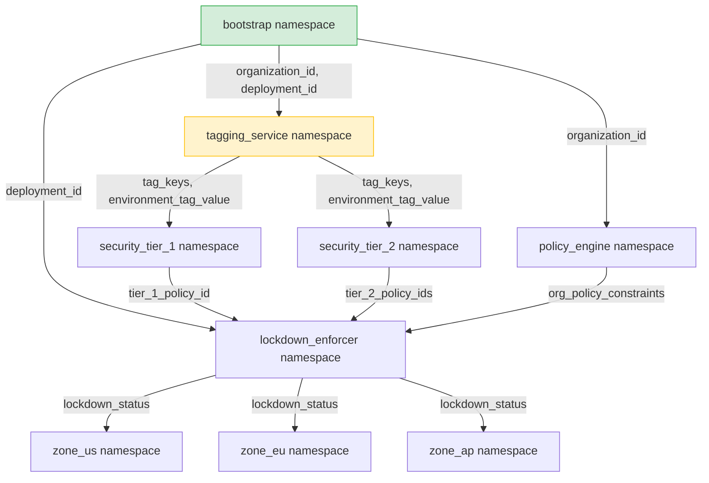

# Complex Multi-Stack Terraform Deployment Example

This directory contains a complete, realistic example of a multi-stack deployment topology managed using **Varlet**. It is modeled after a security automation graph (originally defined in `~/graph.dot`), with the stack names adjusted to be non-confidential.

## Dependency Graph

The following diagram illustrates how state and variables flow across the different stacks (namespaces) in this deployment:



## Features Demonstrated

1. **Private by Default Security Model:**
   Namespaces only permit consumption by stacks that are explicitly configured in their `allowed_consumers` list.
2. **Public Namespace:**
   The `bootstrap` stack demonstrates a public namespace by setting `allowed_consumers = ["*"]`, making its variables consumable by any stack.
3. **Webhook Propagation Delay & Deduplication:**
   Demonstrates delaying and debouncing outgoing webhook triggers:
   * **Delay:** The `tagging_service` stack is configured with `webhook_delay_minutes = 2` to simulate a stack actuation delay without blocking the upstream bootstrap run.
   * **Deduplication:** Uses `dedup_delay_minutes` and `max_dedup_changes` to pool multiple writes to upstream dependencies into a single downstream trigger execution, preventing redundant runs.
4. **Actuation Lineage Tracking:**
   Tracks individual Terraform run UUIDs (`VARLET_ACTUATION_UUID`) and maps their parent-child relationships (`VARLET_UPSTREAM_ACTUATION_UUIDS`) in the database on apply, forming a lineage DAG.
5. **Ancestry Trace & Graph Highlighting:**
   Allows operators to query a recursive CTE ancestry path (`/api/trace`) for a specific actuation, highlighting the exact path of affected nodes and edges on the graph while fading out non-participating components.
6. **Rich Variable Types:**
   Demonstrates passing diverse Terraform types over Varlet, including:
   * **Strings:** (`organization_id`, `deployment_id`, `environment_tag_value`)
   * **Lists:** (`tag_keys`, `org_policy_constraints`)
   * **Maps:** (`tier_2_policy_ids`)
   * **Objects:** (`lockdown_status` containing structural metadata)

## Directory Structure

Each stack is placed in its own folder and should be actuated independently:
*   [bootstrap/](file:///usr/local/google/home/gkandriotti/code/tf-remote-vars/examples/multi-stack-deployment/bootstrap/main.tf) - Root values (Public).
*   [tagging_service/](file:///usr/local/google/home/gkandriotti/code/tf-remote-vars/examples/multi-stack-deployment/tagging_service/main.tf) - Handles Tag Keys and Bindings. Actuation is delayed by 2 minutes on upstream updates.
*   [security_tier_1/](file:///usr/local/google/home/gkandriotti/code/tf-remote-vars/examples/multi-stack-deployment/security_tier_1/main.tf) - Security Level 1 config.
*   [security_tier_2/](file:///usr/local/google/home/gkandriotti/code/tf-remote-vars/examples/multi-stack-deployment/security_tier_2/main.tf) - Security Levels 2-4 config.
*   [policy_engine/](file:///usr/local/google/home/gkandriotti/code/tf-remote-vars/examples/multi-stack-deployment/policy_engine/main.tf) - Organization Policy Constraints.
*   [lockdown_enforcer/](file:///usr/local/google/home/gkandriotti/code/tf-remote-vars/examples/multi-stack-deployment/lockdown_enforcer/main.tf) - Aggregates policies and performs lockdown.
*   `regional_landing_zones/` - Terminal customer stacks:
    *   [zone_us/](file:///usr/local/google/home/gkandriotti/code/tf-remote-vars/examples/multi-stack-deployment/regional_landing_zones/zone_us/main.tf) - US Region landing zone.
    *   [zone_eu/](file:///usr/local/google/home/gkandriotti/code/tf-remote-vars/examples/multi-stack-deployment/regional_landing_zones/zone_eu/main.tf) - EU Region landing zone.
    *   [zone_ap/](file:///usr/local/google/home/gkandriotti/code/tf-remote-vars/examples/multi-stack-deployment/regional_landing_zones/zone_ap/main.tf) - AP Region landing zone.

## Running the Example

### 1. Compile the Binaries

From the repository root, compile the Varlet Server and the Terraform Provider:

```bash
# Build the Varlet Server
CGO_ENABLED=0 go build -o varlet-server ./cmd/varlet-server

# Build the Varlet Terraform Provider
CGO_ENABLED=0 go build -o terraform-provider-varlet ./cmd/terraform-provider-varlet
```

### 2. Configure Terraform Developer Overrides & Local Mirror

Since this is a local provider that is not published to the public Terraform registry, you must configure a Terraform developer override so Terraform finds the local binary.

Additionally, because the examples use other public providers (like `time` and `null`), you must run `terraform init` to download them. To prevent `terraform init` from failing when it tries to query the registry for `google/varlet`, you must also set up a local filesystem mirror.

#### Step 2a: Create the Local Mirror Directory
Create a directory structure that mimics a registry structure and symlink your compiled provider binary into it:

```bash
# Create the mirror directory structure (example for Linux AMD64)
mkdir -p ~/.terraform-mirror/registry.terraform.io/google/varlet/1.0.0/linux_amd64

# Symlink the compiled provider binary
ln -s /path/to/tf-remote-vars/terraform-provider-varlet ~/.terraform-mirror/registry.terraform.io/google/varlet/1.0.0/linux_amd64/terraform-provider-varlet_v1.0.0
```
*(Make sure to replace `/path/to/tf-remote-vars` with the absolute path to your repository directory where the `terraform-provider-varlet` binary was built).*

#### Step 2b: Configure `~/.terraformrc`
Create or edit your `~/.terraformrc` file to configure both the developer override (for running) and the filesystem mirror (to allow `init` to succeed):

```hcl
provider_installation {
  # Directs Terraform to use the local binary directly for plan/apply
  dev_overrides {
    "google/varlet" = "/path/to/tf-remote-vars"
  }

  # Allows 'terraform init' to satisfy the google/varlet dependency locally
  filesystem_mirror {
    path    = "/path/to/your/home/.terraform-mirror"
    include = ["google/varlet"]
  }

  # Directs Terraform to download all other providers from the public registry
  direct {
    exclude = ["google/varlet"]
  }
}
```
*(Make sure to replace `/path/to/tf-remote-vars` and `/path/to/your/home` with your actual absolute paths. Terraform does not expand `~` in the `path` attribute).*

### 3. Start the Varlet Server

Start the server. By default, this starts a gRPC server on port `8080` (for Terraform) and an HTTP server on port `8081` (for the Web UI).

```bash
./varlet-server
```

### 4. Actuate the Stacks

Actuate the stacks in order of their dependencies. Since we have a delayed webhook, we can simulate manual actuation here. Open a separate terminal and apply them sequentially:

```bash
DEMO_SH=$(mktemp)

cat > ${DEMO_SH} << __END__

export SUFFIX=\$(date --utc +"%Y%m%d-%H%m%S")
export TF_CLI_CONFIG_FILE="\${HOME}/.terraformrc"

export BOOTSTRAP_UUID=\$(uuidgen)
export POLICY_ENGINE_UUID=\$(uuidgen)
export TAGGING_UUID=\$(uuidgen)
export SEC_TIER_1_UUID=\$(uuidgen)
export SEC_TIER_2_UUID=\$(uuidgen)
export LOCKDOWN_UUID=\$(uuidgen)
export ZONE_US_UUID=\$(uuidgen)
export ZONE_EU_UUID=\$(uuidgen)
export ZONE_AP_UUID=\$(uuidgen)

# 0. For local development, remove the locks
find \$(pwd)/examples/multi-stack-deployment -name ".terraform.lock.hcl" -exec rm -f {} \;

# 1. Apply Bootstrap
pushd \$(pwd)/examples/multi-stack-deployment/bootstrap
terraform init -upgrade
VARLET_ACTUATION_UUID=\${BOOTSTRAP_UUID} terraform apply -auto-approve -var="suffix=\${SUFFIX}"
popd

# 2. Apply Policy Engine & Tagging Service (parallel or order doesn't matter)
pushd \$(pwd)/examples/multi-stack-deployment/policy_engine
terraform init -upgrade
VARLET_ACTUATION_UUID=\${POLICY_ENGINE_UUID} VARLET_UPSTREAM_ACTUATION_UUIDS=\${BOOTSTRAP_UUID} terraform apply -auto-approve -var="suffix=\${SUFFIX}"
popd

pushd \$(pwd)/examples/multi-stack-deployment/tagging_service
terraform init -upgrade
VARLET_ACTUATION_UUID=\${TAGGING_UUID} VARLET_UPSTREAM_ACTUATION_UUIDS=\${BOOTSTRAP_UUID} terraform apply -auto-approve -var="suffix=\${SUFFIX}"
popd

# 3. Apply Security Tier 1 & 2
pushd \$(pwd)/examples/multi-stack-deployment/security_tier_1
terraform init -upgrade
VARLET_ACTUATION_UUID=\${SEC_TIER_1_UUID} VARLET_UPSTREAM_ACTUATION_UUIDS=\${TAGGING_UUID} terraform apply -auto-approve -var="suffix=\${SUFFIX}"
popd

pushd \$(pwd)/examples/multi-stack-deployment/security_tier_2
terraform init -upgrade
VARLET_ACTUATION_UUID=\${SEC_TIER_2_UUID} VARLET_UPSTREAM_ACTUATION_UUIDS=\${TAGGING_UUID} terraform apply -auto-approve -var="suffix=\${SUFFIX}"
popd

# 4. Apply Lockdown Enforcer
pushd \$(pwd)/examples/multi-stack-deployment/lockdown_enforcer
terraform init -upgrade
VARLET_ACTUATION_UUID=\${LOCKDOWN_UUID} VARLET_UPSTREAM_ACTUATION_UUIDS=\${BOOTSTRAP_UUID},\${SEC_TIER_1_UUID},\${SEC_TIER_2_UUID},\${POLICY_ENGINE_UUID} terraform apply -auto-approve
popd

# 5. Apply Regional Zones (US, EU, AP)
pushd \$(pwd)/examples/multi-stack-deployment/regional_landing_zones/zone_us
terraform init -upgrade
VARLET_ACTUATION_UUID=\${ZONE_US_UUID} VARLET_UPSTREAM_ACTUATION_UUIDS=\${LOCKDOWN_UUID} terraform apply -auto-approve
popd

pushd \$(pwd)/examples/multi-stack-deployment/regional_landing_zones/zone_eu
terraform init -upgrade
VARLET_ACTUATION_UUID=\${ZONE_EU_UUID} VARLET_UPSTREAM_ACTUATION_UUIDS=\${LOCKDOWN_UUID} terraform apply -auto-approve
popd

pushd \$(pwd)/examples/multi-stack-deployment/regional_landing_zones/zone_ap
terraform init -upgrade
VARLET_ACTUATION_UUID=\${ZONE_AP_UUID} VARLET_UPSTREAM_ACTUATION_UUIDS=\${LOCKDOWN_UUID} terraform apply -auto-approve
popd
__END__

echo "Demo script in '${DEMO_SH}'"

sh ${DEMO_SH}
```

### 5. Inspect the Web UI

Open your browser and navigate to:

[http://localhost:8081](http://localhost:8081)

**What to look for in the UI:**
1. **Interactive Dependency Graph:** You will see the visual representation of all 9 namespaces connected by directed edges indicating the variables flow (e.g. `bootstrap` &rarr; `tagging_service`).
2. **Namespace Details:** Clicking on any node displays details such as its webhook URL, access policies (`allowed_consumers`), and variables exported.
3. **Actuation Simulation:** Double-click the `bootstrap` node to trigger a simulated update. Click "Next Step" to advance propagation step-by-step:
   * Notice that when `bootstrap` updates, `tagging_service`'s state turns to `potentially-affected` and then transitions to `actuating` with the 2-minute delay simulated visually.
   * Watch the state changes propagate downstream to the `regional_landing_zones` nodes.

---

## Step-by-Step Feature Showcase

Here is a step-by-step walkthrough to demonstrate the core features of **Varlet**, including authorization, webhook deduplication, actuation lineage, and interactive tracing.

### 1. Demonstrate Private-by-Default Security
Varlet namespaces are private by default. Let's see this in action:
1. Navigate to the `tagging_service` directory and inspect `main.tf`. It consumes variables from `bootstrap`.
2. Open `bootstrap/main.tf` and temporarily remove `"tagging_service"` from the `allowed_consumers` list on the `varlet_namespace.self` resource.
3. Run `terraform apply` in `bootstrap` to apply the change.
4. Now, go to `tagging_service` and run `terraform plan`. It will fail with a `PermissionDenied` error because `tagging_service` is no longer authorized to consume variables from `bootstrap`.
5. Restore the allowed consumers in `bootstrap/main.tf` and run `terraform apply` again to restore access.

### 2. Run Actuations with Lineage Tracking
In a real CI/CD pipeline, each stack run has a unique run ID, and downstream runs are triggered by upstream runs. We can simulate this using the `VARLET_ACTUATION_UUID` and `VARLET_UPSTREAM_ACTUATION_UUIDS` environment variables:

1. **Start the Bootstrap Actuation:**
   Generate a UUID for the bootstrap run and apply:
   ```bash
   export BOOTSTRAP_UUID=$(uuidgen)
   cd examples/multi-stack-deployment/bootstrap
   VARLET_ACTUATION_UUID=$BOOTSTRAP_UUID terraform apply -auto-approve
   ```
   This registers the `bootstrap` actuation with ID `$BOOTSTRAP_UUID` in the backend.

2. **Start the Tagging Service Actuation:**
   Since `tagging_service` depends on `bootstrap`, we pass the bootstrap run ID as the parent:
   ```bash
   export TAGGING_UUID=$(uuidgen)
   cd ../tagging_service
   VARLET_ACTUATION_UUID=$TAGGING_UUID VARLET_UPSTREAM_ACTUATION_UUIDS=$BOOTSTRAP_UUID terraform apply -auto-approve
   ```
   This establishes a parent-child relationship: `$BOOTSTRAP_UUID` -> `$TAGGING_UUID`.

3. **Start downstream Security Tier 1 Actuation:**
   Similarly, run `security_tier_1` passing `tagging_service`'s run ID as parent:
   ```bash
   export TIER1_UUID=$(uuidgen)
   cd ../security_tier_1
   VARLET_ACTUATION_UUID=$TIER1_UUID VARLET_UPSTREAM_ACTUATION_UUIDS=$TAGGING_UUID terraform apply -auto-approve
   ```

### 3. Showcase Webhook Deduplication
We can demonstrate webhook deduplication using the `tagging_service` namespace, which is configured with `dedup_delay_minutes = 2` and `max_dedup_changes = 3`.

1. Check the Varlet server log. When `bootstrap` writes its outputs, Varlet does not fire webhooks immediately. Instead, it queues a pending webhook for `tagging_service` and `policy_engine`.
2. If you write to `bootstrap` multiple times (e.g. updating a variable value), the server consolidates these writes into the same pending webhook trigger, updating its `fire_at` target.
3. Once the 2-minute quiet window expires (or 3 distinct changes are accumulated), the background worker fires the webhook, generating a new `Trigger UUID`.
4. The database records all the accumulated bootstrap parent actuation UUIDs mapping to this new Trigger UUID.

### 4. Interactive Ancestry Trace in the Web UI
Now let's use the Web UI to visualize the dependency status and trace the actuation path:

1. Open [http://localhost:8081](http://localhost:8081) in your browser.
2. You will see the current status of all nodes:
   * **Succeeded (Green):** Stacks that have recently finished their actuations.
   * **Affected (Orange):** Stacks whose upstream dependencies have updated, but they haven't run yet to ingest the new values.
3. Click on the `security_tier_1` node. The right-hand **Sidebar** will slide open showing:
   * Current status and metadata.
   * **Causal Actuation UUIDs:** A list of upstream run IDs that made this node "affected". You should see the `$TAGGING_UUID` we passed earlier.
   * **Last Actuation UUID:** The ID of the last successful run for this stack (`$TIER1_UUID`).
4. Click on one of the UUIDs in the **Causal Actuation UUIDs** list.
5. The UI will call the `/api/trace` endpoint, fetch the recursive parent lineage, and highlight the path:
   * The graph will fade out non-participating nodes.
   * The exact path of nodes and edges representing the propagation chain (e.g., `bootstrap` &rarr; `tagging_service` &rarr; `security_tier_1`) will be highlighted in bright orange.
6. Click the "Exit Trace" button in the sidebar or press the `Escape` key to clear the highlight and return the graph to its normal state.

