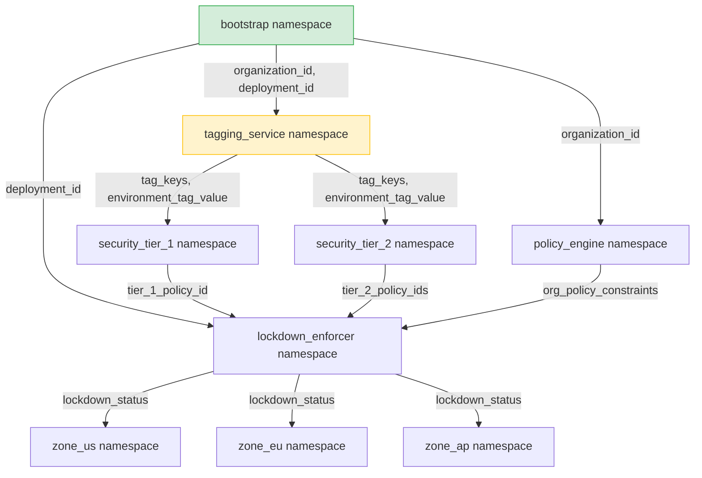

# Complex Multi-Stack Terraform Deployment Example

This directory contains a complete, realistic example of a multi-stack deployment topology managed using **Varlet**. It is modeled after a security automation graph (originally defined in `~/graph.dot`), with the stack names adjusted to be non-confidential.

## Dependency Graph

The following diagram illustrates how state and variables flow across the different stacks (namespaces) in this deployment:



## Features Demonstrated

1. **Private by Default Security Model:**
   Namespaces only permit consumption by stacks that are explicitly configured in their `allowed_consumers` list.
2. **Public Namespace:**
   The `bootstrap` stack demonstrates a public namespace by setting `allowed_consumers = ["*"]`, making its variables consumable by any stack.
3. **Webhook Propagation Delay:**
   The `tagging_service` stack is configured with `webhook_delay_minutes = 2` alongside its `run_webhook_url`. When `bootstrap` updates and notifies its consumers, the backend waits for 2 minutes before triggering the `tagging_service` webhook, simulating a stack actuation delay without blocking the upstream bootstrap run.
4. **Rich Variable Types:**
   Demonstrates passing diverse Terraform types over Varlet, including:
   * **Strings:** (`organization_id`, `deployment_id`, `environment_tag_value`)
   * **Lists:** (`tag_keys`, `org_policy_constraints`)
   * **Maps:** (`tier_2_policy_ids`)
   * **Objects:** (`lockdown_status` containing structural metadata)

## Directory Structure

Each stack is placed in its own folder and should be actuated independently:
*   [bootstrap/](file:///usr/local/google/home/gkandriotti/code/tf-remote-vars/examples/multi-stack-deployment/bootstrap/main.tf) - Root values (Public).
*   [tagging_service/](file:///usr/local/google/home/gkandriotti/code/tf-remote-vars/examples/multi-stack-deployment/tagging_service/main.tf) - Handles Tag Keys and Bindings. Actuation is delayed by 2 minutes on upstream updates.
*   [security_tier_1/](file:///usr/local/google/home/gkandriotti/code/tf-remote-vars/examples/multi-stack-deployment/security_tier_1/main.tf) - Security Level 1 config.
*   [security_tier_2/](file:///usr/local/google/home/gkandriotti/code/tf-remote-vars/examples/multi-stack-deployment/security_tier_2/main.tf) - Security Levels 2-4 config.
*   [policy_engine/](file:///usr/local/google/home/gkandriotti/code/tf-remote-vars/examples/multi-stack-deployment/policy_engine/main.tf) - Organization Policy Constraints.
*   [lockdown_enforcer/](file:///usr/local/google/home/gkandriotti/code/tf-remote-vars/examples/multi-stack-deployment/lockdown_enforcer/main.tf) - Aggregates policies and performs lockdown.
*   `regional_landing_zones/` - Terminal customer stacks:
    *   [zone_us/](file:///usr/local/google/home/gkandriotti/code/tf-remote-vars/examples/multi-stack-deployment/regional_landing_zones/zone_us/main.tf) - US Region landing zone.
    *   [zone_eu/](file:///usr/local/google/home/gkandriotti/code/tf-remote-vars/examples/multi-stack-deployment/regional_landing_zones/zone_eu/main.tf) - EU Region landing zone.
    *   [zone_ap/](file:///usr/local/google/home/gkandriotti/code/tf-remote-vars/examples/multi-stack-deployment/regional_landing_zones/zone_ap/main.tf) - AP Region landing zone.

## Running the Example

### 1. Compile the Binaries

From the repository root, compile the Varlet Server and the Terraform Provider:

```bash
# Build the Varlet Server
CGO_ENABLED=0 go build -o varlet-server ./cmd/varlet-server

# Build the Varlet Terraform Provider
CGO_ENABLED=0 go build -o terraform-provider-varlet ./cmd/terraform-provider-varlet
```

### 2. Configure Terraform Developer Overrides

Since this is a local provider, you must configure a Terraform developer override so Terraform finds the local binary instead of pulling from the registry.

Create or edit your `~/.terraformrc` file and add the following:

```hcl
provider_installation {
  dev_overrides {
    "google/varlet" = "/path/to/tf-remote-vars"
  }
  direct {}
}
```
*(Make sure to replace the path with the absolute path to your repository directory where the `terraform-provider-varlet` binary was built).*

### 3. Start the Varlet Server

Start the server. By default, this starts a gRPC server on port `8080` (for Terraform) and an HTTP server on port `8081` (for the Web UI).

```bash
./varlet-server
```

### 4. Actuate the Stacks

Actuate the stacks in order of their dependencies. Since we have a delayed webhook, we can simulate manual actuation here. Open a separate terminal and apply them sequentially:

```bash
# 1. Apply Bootstrap
cd examples/multi-stack-deployment/bootstrap
terraform init
terraform apply -auto-approve

# 2. Apply Policy Engine & Tagging Service (parallel or order doesn't matter)
cd ../policy_engine
terraform init
terraform apply -auto-approve

cd ../tagging_service
terraform init
terraform apply -auto-approve

# 3. Apply Security Tier 1 & 2
cd ../security_tier_1
terraform init
terraform apply -auto-approve

cd ../security_tier_2
terraform init
terraform apply -auto-approve

# 4. Apply Lockdown Enforcer
cd ../lockdown_enforcer
terraform init
terraform apply -auto-approve

# 5. Apply Regional Zones (US, EU, AP)
cd ../regional_landing_zones/zone_us
terraform init
terraform apply -auto-approve

cd ../zone_eu
terraform init
terraform apply -auto-approve

cd ../zone_ap
terraform init
terraform apply -auto-approve
```

### 5. Inspect the Web UI

Open your browser and navigate to:

[http://localhost:8081](http://localhost:8081)

**What to look for in the UI:**
1. **Interactive Dependency Graph:** You will see the visual representation of all 9 namespaces connected by directed edges indicating the variables flow (e.g. `bootstrap` &rarr; `tagging_service`).
2. **Namespace Details:** Clicking on any node displays details such as its webhook URL, access policies (`allowed_consumers`), and variables exported.
3. **Actuation Simulation:** Double-click the `bootstrap` node to trigger a simulated update. Click "Next Step" to advance propagation step-by-step:
   * Notice that when `bootstrap` updates, `tagging_service`'s state turns to `potentially-affected` and then transitions to `actuating` with the 2-minute delay simulated visually.
   * Watch the state changes propagate downstream to the `regional_landing_zones` nodes.

